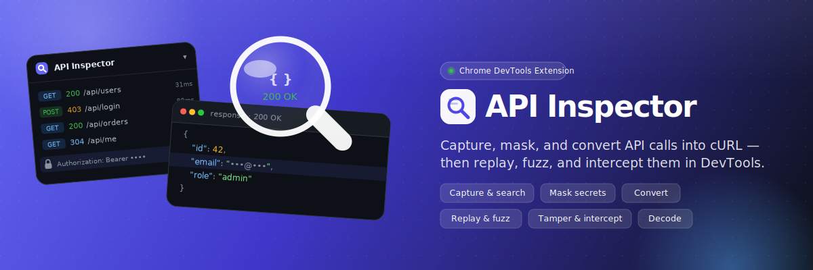

# API Inspector

A Chromium (Manifest V3) DevTools panel extension that captures a page's API calls and turns them into something you can search, mask, convert, and replay. It reads traffic through the official DevTools API — no network interception, no host permissions — so the only permission it asks for is `storage`. Think of it as the Network tab's "Copy as cURL", supercharged with search, masking, conversion, diffing, and export.

Korean: [README.ko.md](README.ko.md)

## What it does

Capture and browse:
- DevTools panel — integrated as an "API Inspector" tab inside F12
- Captures XHR / fetch as the page makes them, in a virtualized request list
- Filters — regex (URL), method, status class, hide static assets, full-text body search
- JSON tree view — collapsible tree for request / response bodies
- Response search — regex highlight within a response body

Mask and share:
- Auto masking — `Authorization` / `Cookie` / `*-token` headers and `token` / `key` / `password` query params hidden on display and in every export
- Body PII masking — credit card numbers (Luhn-validated, last 4 kept), emails, JWTs, bearer tokens, and Korean resident registration numbers detected and redacted in bodies, headers, and query values
- Placeholder mode — swap credentials for `$AUTH_TOKEN` / `{{AUTH_TOKEN}}` so a shared command stays runnable without exposing the real token

Convert and document:
- Convert — cURL (multiline, multipart/form), HTTPie, Postman Collection
- Endpoint docs — auto-generate Markdown documentation
- Export / import — round-trips Postman Collection, HAR, and session JSON (re-importable with response bodies inline); Markdown is export-only, HAR / Postman / session JSON are auto-detected on import

Replay and test:
- Edit and resend — edit a captured request (method / URL / headers / body), substitute `{{variables}}`, and resend it through the inspected page's own session (no extra permissions, no CORS); the response is compared against the original
- Variables — define `{{KEY}}` values once, reuse them on resend
- Diff — compare two requests (status / query / headers / body)
- Fuzz — Intruder-style: mark a spot with `${}`, supply a payload list, replay through the page session; results table flags length / status outliers (authorized wargames / CTF only)

Tools:
- Standalone viewer — a full-tab viewer for importing and analyzing HAR / session files without DevTools (live capture stays in the DevTools panel)
- Toolbox — Base64 / URL / Hex / JWT encode-decode, MD5 / SHA-1 / SHA-256 hashes, and a regex scan across all captured response bodies (e.g. to surface `flag{...}`)

## How it works

The panel registers inside DevTools and listens to `chrome.devtools.network` for request events, normalizing each HAR entry into a `CapturedRequest`; response bodies are loaded lazily. Resending and fuzzing run through `inspectedWindow.eval` in the page's own context, so requests reuse the page session and need no extra permissions or CORS handling.

The core logic (`src/core/`) — normalize, mask, filter, convert, diff, HAR, Postman, Markdown — is pure functions with no browser dependency, so what gets redacted is verifiable and covered by unit tests. The UI is React 19 + Zustand, virtualized with @tanstack/react-virtual, built with Vite 6 / CRXJS 2 / Tailwind 4 on TypeScript (strict), and tested with Vitest (component tests run on jsdom with a mocked `chrome.devtools`).

Project structure:
```
src/
  devtools/      DevTools panel registration
  panel/         React panel UI (FilterBar / RequestList / DetailPanel / ...)
    store/       Zustand state
    hooks/       network capture, response body lazy load
  core/          pure logic (tested)
    normalize    HAR -> CapturedRequest
    mask         sensitive header / query / body masking
    filter       filter engine
    convert/     cURL / HTTPie / Postman conversion
  types.ts
```

## Security and privacy

The whole point of the masking feature is safe sharing. The DevTools "Copy as cURL" copies your `Authorization: Bearer ...` token verbatim — paste that into Slack and you have leaked a credential. API Inspector is built to prevent exactly that.

- Fully local — nothing ever leaves the browser. No backend, no analytics, no third-party requests.
- Automatic secret masking — sensitive headers and query params are masked both in the UI and in every export.
- Body PII masking — bodies, headers, and query values are scanned for credit card numbers, emails, JWTs, bearer tokens, and resident registration numbers and redacted, so requests can be shared without leaking PII.
- Minimal permissions — only `storage`. No `webRequest`, no host permissions, no content scripts; traffic is read through the official DevTools API, not by intercepting the network.
- Auditable — the masking and conversion logic are pure functions covered by unit tests, so what gets redacted is verifiable.


## License

MIT. Author: Huido Choo.
